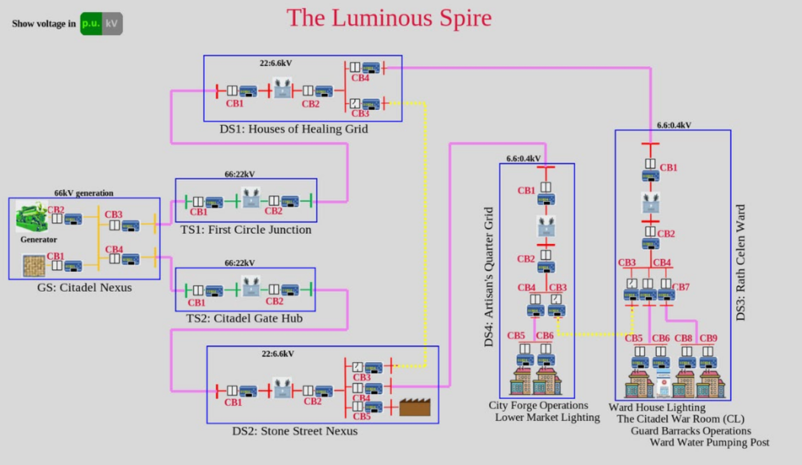
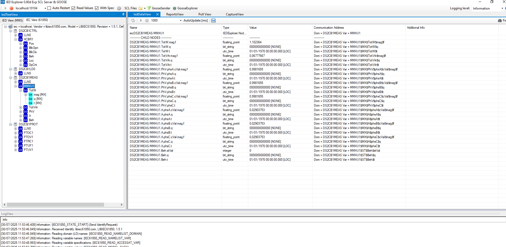

# POWER

One of the challenge groups provided by the CISS CTF was related to power systems. The setup was based on the IEC-61850 MMS and GOOSE protocols. 

## The Healing Chamber's Control Crystal

*Among the Programmable Logic Controllers (PLCs) that govern the mystical energy systems within the Houses of Healing Grid, locate the one with the highest IP address.*

The first challenge provided us with a PCAP file and the request to find the highest IP address for the "House of Healing GRID". After some analysis in the communication flow we came up with the following table that grouped the communication flow. For analysis of the PCAP files in the challange we used [Skunkworks network Analyzer](https://www.otb-consultingservices.com/brainpower/shop/skunkworks-network-analyzer/), which is a fork of Wireshark and great tool for analyzing ICS network traffic and protocols like GOOSE and MMS as it comes with preinstalled support to parse the body of such package frames.


This is the list of endpoints as WireShark provided us with. Enriched with notes on which endpoint communicated with each other. So we figured the highest IP is the **172.100.0.18** which was wrong. Looking at the communication flow we figured, that this IP might be an HMI because every endpoint except the *.41 IPs send information to it. Therefor it might not be an IED as specified in the challenge.

Next we tried **172.26.20.41** which was also wrong. Looking at the flow again we could see that the IPs 172.26.20.0/24 send information to this IP. So it might be that they are an PLC controling the IEDs. So we tried **172.26.20.16** which was also wrong.

At this point we felt a bit stuck and decided to look at the next challenge, which proved to be very helpful as it provided us with the following plot: 



This is super helpful also for the first challange, especially as we now know that the network segments are named and there es a specific segmet we wer asked the "House of Healing". With this plot we were able to map the network segments to the IPs we found in the first challenge and identified the correct IP as **172.24.10.14**. 

**CISS25{172.24.10.14}**

## The Industrial Power Guardians of Stone Street Nexus

*Your Mission: Find the IP addresses of the IEDs that control the circuit breakers protect the industrial mystical loads in the Stone Street Nexus. Look at the network traffic to look for this IED. Please submit the highest IP address based on your discovery.*

With this information it was also easy to identify the second IP asked for, the Industrial loads in the "Stone Street Nexus" which was the **172.26.10.15**

**CISS25{172.26.10.15}**

## The Reconnaissance of the Luminous Spire

*Task - Mystical Device Location: Identify the ethereal addresses (IP addresses) of the IED in the Artisan's Quarter Grid. Locate the one with the highest IP address.*

Also the next challange was easy to solve as we were asked to identify the highest IP address in the "Artisan's Quarter Grid" which is the **172.26.20.16**.

**CISS25{172.26.20.16}**

## The Mystical Energy Audit of Stone Street Nexus

The next challenge was more tricky again. 
    
*Your Mission: Execute targeted mystical queries against the Intelligent Energy Distributors within the Stone Street Nexus (DS2 substation) to extract critical power measurement data from the industrial sector. This investigation will demonstrate how an Enemy agent might gather intelligence about our energy systems or how our defenders can monitor system health.*

*Task - Industrial Power Analysis: Using the IEC61850 MMS protocol, send targeted queries to the relevant IEDs controlling the Stone Street Nexus substation to determine the precise real power consumption at the mystical energy bus that feeds the industrial manufacturing operations. (4 digits percision)*

So we knew our target was the **172.26.10.15** IP address and now we had to find appropriate tooling to query the IED. This proved challanging, as the setup involved tunneling into the infrastructure over several Jump systems to reach the systems that allowed us to access the IED. This ment we had to download and migrate all the tools my hand to the target system and cloud not simply install them via the registry.

Our target system was a Alpine Linux 3.20 which was most likely a Docker container. To install tools like `tcpdump` or `nmap` we used the following docker command that downloaded us all the resources with the needed dependenceis.

```bash
docker run --rm \
  -v /tmp/alpine_offline_packages/nmap:/alpine_packages \
  alpine:3.20 \
  sh -c "apk update && apk fetch --recursive nmap --output /alpine_packages/"
4:29 PM
```

also we setup a SSH config for tunneling into the systems more easily. One mistake here was to use a ssh key with a passphrase, that we had to enter several times for each jump every time we opened a new SSH connection or copied a file via ssh:

```
Host ciss-power
        HostName 200.200.200.200
        User iarcs
        Port 2222
        IdentityFile ~/.ssh/Key
        ProxyJump ciss

Host ciss-jump
        HostName users.ncl.sg
        User cissrt37
        IdentityFile ~/.ssh/Key

Host ciss
        HostName x3550.ddns.comp.nus.edu.sg
        User cissrt37
        Port 4637
        IdentityFile ~/.ssh/Key
        ProxyJump ciss-jump
```

However, while nmap was good for scanning, and tcpdump allowed us to capture traffic comming from the **172.26.10.11** showing us GOOSE messages, we needed a tool that allowed us to query the IED directly. We first tried to use the libiec61850 c library and its python bindings, but this did not work out for us as the library was hard to build on the Alpine Linux system, an then we still would have to implement an script to query the IED.

So we looked for other tooling with more of a focus on analytics tools and encountered the [IED explorer](https://sourceforge.net/projects/iedexplorer/), a windows tool hosted on sourceforge. Not our favorite place to take resoures from and also a .NET windows tool, but we were desperate and tried it anyway and it worked out quite well. We used a windows 10 VM to run the tool on and connected via the following ssh tunnel to the IED:

`ssh -L 10102:172.26.10.11:102 -J cissrt37@users.ncl.sg,cissrt37@x3550.ddns.comp.nus.edu.sg:4637 iarcs@200.200.200.200 -p 2222 -i ./key`

The IED Explorer lookes like follows (Unfortunately i now see that this screenshot is of the wrong IED CB1 and not the target CB5). After a conversation with Google Gemini about how naming conventions work in the IEC-61850 standard we figured that the value we were looking for is the `MMUX1.TotW.mag.f` which was exactly 1.0000.



**CISS25{1.0000}**

## Pinpointing the Moment of Infiltration

*As part of your forensic investigation into the Houses of Healing Grid crisis, you must identify the precise moment when the Enemy's mystical interception attack began.*

*Your Mission: Through careful examination of the Logic Crystal's specific network traffic archive (CHL5.2.pcap), determine exactly when the first corrupted MMS packet was injected by the Enemy agents during their mystical man-in-the-middle attack.*

*Forensic Challenge: The attackers positioned themselves between legitimate mystical devices to intercept and manipulate the sacred communication protocols. By identifying the first manipulated packet, you can establish: The exact timing of the attack initiation
The duration of the Enemy's control over the communication channel
The scope of potentially compromised mystical transmissions
The attack progression and escalation patterns
Submit: CISS25{Packet Number}*

#### Initial Recon

The evidence provided included:

* `CHL5.2.pcap` — a network traffic capture of the grid’s communication.
* `CHL5.csv` — a tabular log with timestamps and status flags.

The pcap showed Ethernet traffic containing MMS, GOOSE and ARP messages.

As the challange already mentioned an Man-in-the-Middle attack we were suspecting that we might see an ARP spoofing attack as it is one of the most common techniques used in such scenarios. We recently discussed this in our [paper on the Eenergy25 conference in Rotterdam](https://doi.org/10.1145/3679240.3734647) where we also show that ARP spoofing is often discussed in related work as a Man-in-the-Middle attack vector.

#### Breakthrough — MAC Anomaly

While structural integrity checks didn’t show obvious MMS BER corruption, deeper flow inspection revealed a crucial clue:

In the packages 1083 - 1087 we can see that `e2:77:b1:af:a7:2c` starts spoofing the IP using a Broadcast ARP request to ask Who is 172.24.10.12 and then responds itself that it is `e2:77:b1:af:a7:2c` which is the first sign of the attack.
For IP `172.24.10.12`, the legitimate source MAC was consistent (`da:b8:a8:ed:57:7a`) until **packet 1096**, where it suddenly switched to `e2:77:b1:af:a7:2c`.
The IP remained the same, but the source MAC changed — a clear MITM indicator.
This means the attacker began injecting or modifying packets under a trusted IP identity at **packet 1096**.


---

Also, the timestamp aligns with the expected attack window from the CSV log. Other possible corruption checks (TPKT length mismatch, ASN.1 overflow) didn’t yield a clearer candidate.  No earlier MAC spoof events were detected — confirming **packet 1096** as the first sign of the Enemy’s mystical interception.

---

### Conclusion — Final Flag

The earliest evidence of the Enemy’s mystical interception attack is at:

✅ **CISS25{1096}**

This packet marks the beginning of the manipulated channel and provides the timeline anchor for further impact analysis.

---

**Lesson Learned:**
In complex ICS/SCADA environments, subtle signs like MAC inconsistencies can be the key to detecting stealthy MITM attacks, even when cryptographic or structural checks appear valid. Always cross-check the full OSI stack!
